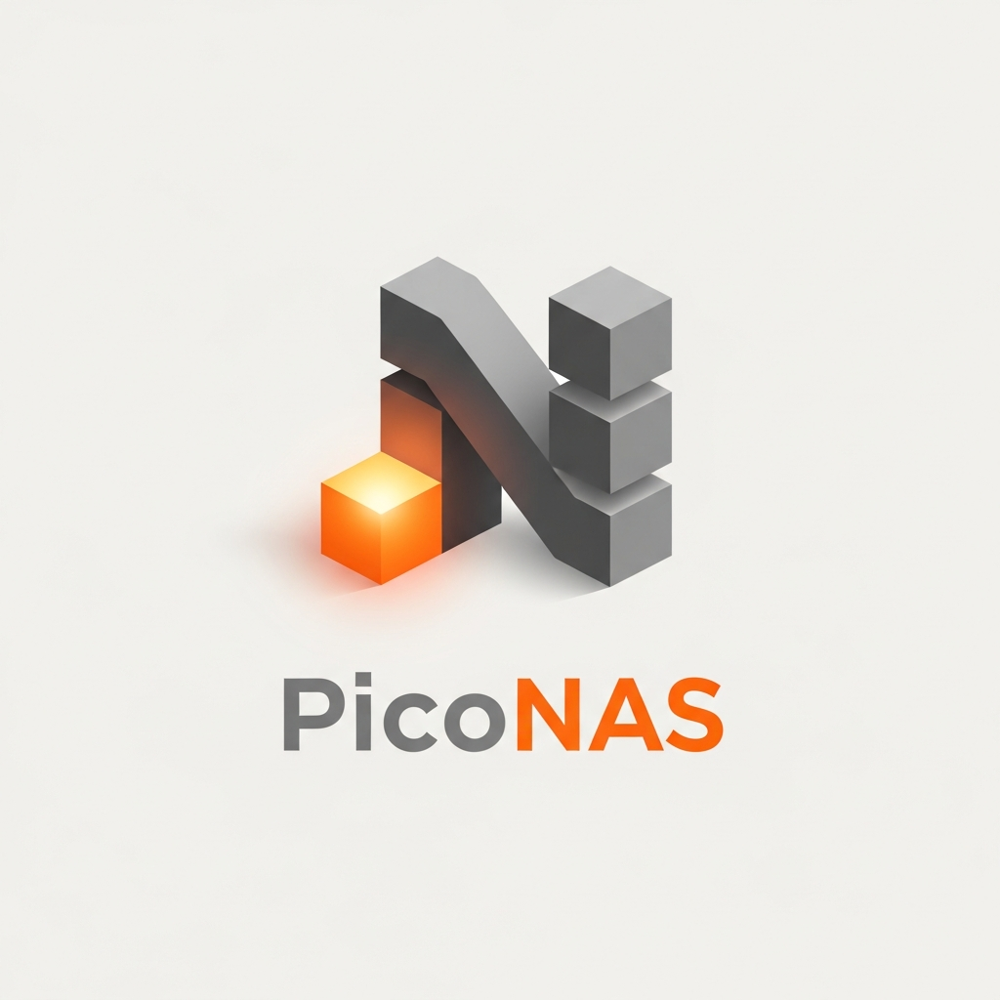
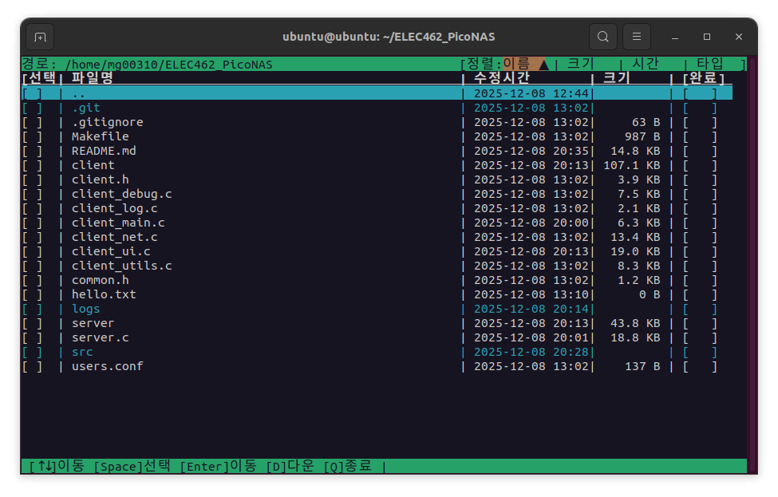
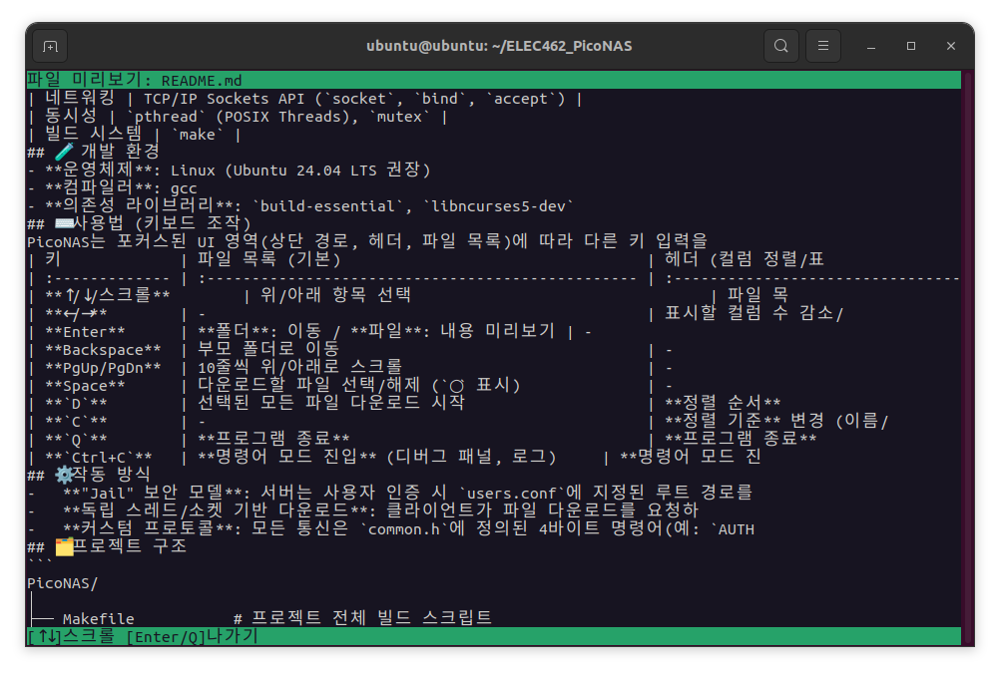
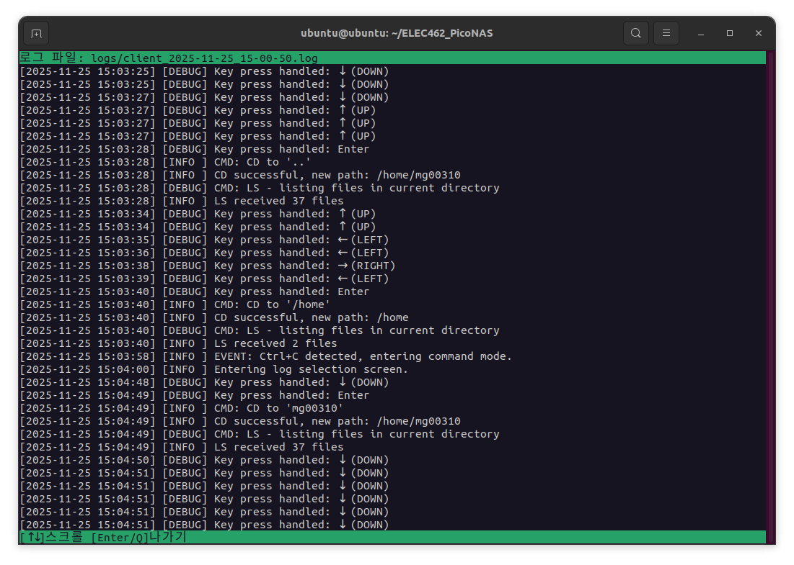

<div align="center">
  <a href="https://github.com/mg00310/ELEC462_PicoNAS">
    
  </a>

  <h3 align="center">PicoNAS</h3>

  <p align="center">
    C언어로 구축된 고기능 경량 터미널 기반 네트워크 연결 스토리지(NAS) 시스템
    <br />
    <small>ELEC462 - 시스템 프로그래밍 프로젝트 team 03</small>
  </p>
</div>

## 📌 프로젝트 개요

**PicoNAS**는 Linux 터미널 환경을 위해 설계된 클라이언트-서버 파일 관리 시스템입니다. C언어로 전적으로 구축되고 `ncurses` 라이브러리를 사용하여, 원격 파일 탐색, 동시 다운로드, 실시간 미리보기 등 강력한 기능들을 빠르고 리소스 친화적인 텍스트 기반 사용자 인터페이스(TUI)로 제공합니다.

- **전체 코드 라인 수 (C언어):** 2,394 라인
- **클라이언트:** 1,803 라인, **서버:** 544 라인, **공통 코드:** 47 라인

## 👥 팀원 정보


| [](https://github.com/mg00310) | [](https://github.com/) |
| :--------------------------------------------------------------------------: | :--------------------------------------------------------------------------: |
| **[임민규]**<br/>PM<br/>프로젝트 세팅<br/>UI/서버/통신 구현<br/><b>기능</b><br/>-다운로드 시각화<br/>-파일 미리보기<br/>-디버그 기능(디버깅 패널/로그) | **[류정민]**<br/><br/>-폴더단위 다운로드 및 다운로드 시 경로 설정<br/>-파일 리스트에서 폴더 전체 용량 표시 및 정렬<br/>-pc에서 서버로 파일 업로드 기능 구현 <br/><br/><br/>>|

## 📷 스크린샷


*메인 파일 탐색기 화면*


*파일 미리보기 화면*


*디버그 패널 활성화 화면*


*로그 뷰어 실행 화면*


*서버 실행 콘솔*


## ✨ 주요 기능

-   **고급 TUI (텍스트 사용자 인터페이스)**
    -   경로 탐색, 정렬/표시 설정, 파일 목록의 **3분할 포커스 시스템**으로 직관적인 조작이 가능합니다.
    -   `ncurses`를 활용한 다채로운 색상과 시각적 효과를 제공합니다.
    -   **텍스트 스크롤링**: 파일명이나 경로명이 길어 화면을 넘어갈 경우 자동으로 스크롤됩니다.
    -   **안전한 종료**: 의도치 않은 `Ctrl+C` 한 번의 입력으로 프로그램이 종료되지 않고, 명령어 모드로 진입하여 안전하게 종료를 제어할 수 있습니다.

-   **파일/디렉터리 관리**
    -   원격 파일 및 디렉터리 목록을 실시간으로 탐색합니다.
    -   **파일 내용 미리보기**: `Enter` 키로 텍스트 기반 파일의 내용을 즉시 확인할 수 있습니다. (바이너리 파일 제외)

-   **동시 다중 파일 다운로드**
    -   `Space` 키로 여러 파일을 선택하고 `D` 키로 동시에 다운로드를 시작할 수 있습니다.
    -   각 다운로드는 별도의 스레드와 소켓에서 처리되어 **UI 멈춤 현상이 없습니다.**
    -   다운로드 진행 상황이 각 파일 행에 **시각적인 진행도 바로 표시**됩니다.
    -   **폴더 다운로드**: 폴더를 선택하면 전체 내용이 tar 아카이브로 압축되어 다운로드됩니다.
    -   **다운로드 경로 설정**: `S` 키를 눌러 파일이 저장될 로컬 디렉토리를 지정할 수 있습니다.

-   **파일 업로드**
    -   `U` 키를 눌러 로컬 파일 브라우저를 열고, 서버로 파일을 업로드할 수 있습니다.
    -   업로드 중에도 별도의 스레드로 처리되어 UI가 멈추지 않습니다.

-   **상세 정보 표시 및 정렬**
    -   파일 이름 외에 **권한, 소유자, 그룹, 크기, 수정 시간** 등 상세 정보를 표시하거나 숨길 수 있습니다.
    -   이름, 크기, 시간, 타입 기준으로 **오름차순/내림차순 정렬**을 지원합니다.

-   **강력한 보안**
    -   `users.conf` 파일을 통한 사용자별 인증을 지원합니다.
    -   **"Jail" 보안 모델**: 각 사용자는 지정된 홈 디렉터리에 격리되어, 상위 디렉터리 접근이나 시스템 파일 접근이 원천적으로 차단됩니다.

-   **개발자 편의 기능**
    -   **실시간 디버그 패널**: `Ctrl+C` 후 `D` 키로 통신 로그 등 내부 상태를 실시간으로 확인할 수 있습니다.
    -   **로그 뷰어**: `Ctrl+C` 후 `L` 키로 클라이언트 로그 파일을 목록에서 선택하고 즉시 내용을 볼 수 있습니다.

## ⚙️ 기술 스택

| 구분 | 사용 기술 및 도구 |
|---|---|
| 언어 | C |
| UI | ncurses |
| 네트워킹 | TCP/IP Sockets API (`socket`, `bind`, `accept`) |
| 동시성 | `pthread` (POSIX Threads), `mutex` |
| 빌드 시스템 | `make` |

## 🧪 개발 환경

- **운영체제**: Linux (Ubuntu 24.04 LTS 권장)
- **컴파일러**: gcc
- **의존성 라이브러리**: `build-essential`, `libncurses5-dev`

## ⌨️ 사용법 (키보드 조작)

PicoNAS는 포커스된 UI 영역(상단 경로, 헤더, 파일 목록)에 따라 다른 키 입력을 받습니다.

| 키             | 파일 목록 (기본)                                  | 헤더 (컬럼 정렬/표시)                       | 경로 탐색                                |
| :------------- | :------------------------------------------------ | :------------------------------------------ | :--------------------------------------- |
| **↑/↓/스크롤**        | 위/아래 항목 선택                                 | 파일 목록 / 경로 탐색으로 포커스 이동       | -                                        |
| **←/→**        | -                                                 | 표시할 컬럼 수 감소/증가                    | 경로 단계(Segment) 간 이동             |
| **Enter**      | **폴더**: 이동 / **파일**: 내용 미리보기 | -                                           | 선택된 경로 단계로 즉시 이동           |
| **Backspace**  | 부모 폴더로 이동                                  | -                                           | -                                        |
| **PgUp/PgDn**  | 10줄씩 위/아래로 스크롤                           | -                                           | -                                        |
| **Space**      | 다운로드할 파일 선택/해제 (`○` 표시)              | -                                           | -                                        |
| **`D`**        | 선택된 모든 파일 다운로드 시작                    | **정렬 순서** 변경 (▲/▼)                    | -                                        |
| **`U`**        | -                                                 | **파일 업로드**                             | -                                        |
| **`S`**        | -                                                 | **다운로드 경로 설정**                      | -                                        |
| **`C`**        | -                                                 | **정렬 기준** 변경 (이름/크기/시간/타입)    | -                                        |
| **`Q`**        | **프로그램 종료**                                 | **프로그램 종료**                           | **프로그램 종료**                        |
| **`Ctrl+C`**   | **명령어 모드 진입** (디버그 패널, 로그)     | **명령어 모드 진입**                        | **명령어 모드 진입**                     |

## ⚙️ 작동 방식

-   **"Jail" 보안 모델**: 서버는 사용자 인증 시 `users.conf`에 지정된 루트 경로를 `realpath()`로 정규화하여 저장합니다. 이후 모든 경로 관련 요청(`CD`, `GET`, `CAT`)에 대해, 최종 경로가 해당 사용자의 루트 경로 내에 포함되는지 검사하여 탈출 시도를 원천적으로 차단합니다.
-   **독립 스레드/소켓 기반 다운로드**: 클라이언트가 파일 다운로드를 요청하면, 메인 UI 스레드는 각 파일에 대해 **새로운 `pthread`를 생성**합니다. 이 새 스레드는 서버로 **새로운 TCP 소켓 연결**을 맺고 인증부터 파일 요청, 데이터 수신까지 독립적으로 처리합니다. 이 아키텍처 덕분에 여러 파일을 동시에 다운로드하면서도 메인 UI는 다른 작업을 계속할 수 있습니다.
-   **커스텀 프로토콜**: 모든 통신은 `common.h`에 정의된 4바이트 명령어(예: `AUTH`, `LS`, `GET`)와 바이너리 데이터를 조합한 커스텀 TCP 프로토콜을 통해 이루어집니다.

## 🗂️ 프로젝트 구조

```
ELEC462_PicoNAS/
│
├── Makefile           # 프로젝트 전체 빌드 스크립트
├── users.conf         # 사용자 자격 증명 및 홈 디렉토리 구성
│
├── common.h           # 공유 헤더: 프로토콜 명령어, 데이터 구조 등
│
├── server.c           # 메인 서버 로직 (연결, 인증, 파일 작업 핸들링)
│
├── client.h           # 클라이언트 전역 변수 및 함수 프로토타입
├── client_main.c      # 메인 클라이언트 로직 (TUI 루프, 키 입력 처리)
├── client_ui.c        # ncurses 기반 TUI 렌더링 코드
├── client_net.c       # 클라이언트-서버 통신 및 다운로드 로직
├── client_utils.c     # 정렬, 경로 파싱 등 각종 유틸리티 함수
├── client_log.c       # 파일 기반 로깅 기능
├── client_debug.c     # 실시간 디버그 패널 및 로그 뷰어 기능
├── client_upload.c    # 서버로 파일 업로드 기능
└── client_download_path.c  # 다운로드 경로 선택 UI
```

## 🛠️ 빌드 및 실행

### 1. 필수 구성 요소

`build-essential` (`make` 및 `gcc`용) 및 `libncurses-dev`가 설치되어 있는지 확인하세요.

```sh
sudo apt-get update
sudo apt-get install build-essential libncurses5-dev
```

### 2. 사용자 구성

`users.conf` 파일을 편집하여 사용자, 비밀번호 및 "jail" 루트 디렉토리를 추가합니다. 각 줄은 `사용자명:비밀번호:/path/to/user/root` 형식을 따릅니다.

**`users.conf` 예시:**
```
guest:1234:/home/user/nas/guest_files
dev:devpass:/home/user/nas/dev_files
```

### 3. 빌드

`make`를 실행하여 클라이언트 및 서버 애플리케이션을 모두 컴파일합니다.

```sh
make
```

실행 파일 (`server` 및 `client`)은 루트 디렉토리에 생성됩니다.

### 4. 애플리케이션 실행

포트 번호를 인자로 지정할 수 있으며, 생략 시 기본 포트(9999)가 사용됩니다.

1.  **서버 시작**:
    터미널을 열고 서버 실행 파일을 실행합니다.
    ```sh
    # 기본 포트 (9999)로 실행
    ./server

    # 8080 포트로 실행
    ./server 8080
    ```

2.  **클라이언트 연결**:
    새 터미널을 열고 서버 IP와 포트 번호(선택 사항)를 인자로 제공하여 클라이언트를 실행합니다.
    ```sh
    # 로컬 서버의 기본 포트로 연결
    ./client 127.0.0.1

    # 로컬 서버의 8080 포트로 연결
    ./client 127.0.0.1 8080
    ```
    로그인을 위해 사용자 이름과 비밀번호를 입력하라는 메시지가 표시됩니다.

### 5. 네트워크 연결 가이드

다양한 네트워크 환경에서 서버에 접속하는 방법입니다.

#### 가. 동일 네트워크 (같은 Wi-Fi 공유기)

서버와 클라이언트가 같은 공유기에 연결된 경우, 서버 PC의 내부 IP 주소를 사용해 접속할 수 있습니다.

1.  **서버 PC에서 내부 IP 확인**: 터미널에 `ip addr` 또는 `ifconfig` 명령어를 입력하여 `192.168.x.x` 또는 `172.x.x.x` 형태의 주소를 찾습니다.  
윈도우 환경은 cmd에서 `ipconfig`를 한 후 똑같이 `192.168.x.x` 형식의 IPv4를 확인합니다.
2.  **클라이언트에서 접속**: 확인한 서버의 내부 IP를 사용해 접속합니다.
    ```sh
    ./client 192.168.1.10 9999
    ```

#### 나. 외부 네트워크 (인터넷)

인터넷을 통해 외부에서 접속하려면, 서버가 실행 중인 공유기에서 **포트 포워딩(Port Forwarding)** 설정이 필요합니다.

1.  **공유기 설정 진입**: 웹 브라우저에서 공유기 관리 페이지(예: `192.168.0.1`)에 접속합니다.
2.  **포트 포워딩 설정**:
    -   **외부 포트**: 외부에서 접속할 포트 번호 (예: 9999)
    -   **내부 IP 주소**: 서버 PC의 내부 IP (예: `192.168.1.10`)
    -   **내부 포트**: 서버 프로그램이 사용하는 포트 (예: 9999)
    -   위 정보를 규칙에 추가합니다. (설정 방식은 공유기 모델마다 다릅니다)
3.  **클라이언트에서 접속**: 공유기의 공인 IP 주소를 사용해 접속합니다. 공인 IP는 네이버 등에서 "내 아이피"를 검색하여 확인할 수 있습니다.
    ```sh
    ./client <공인_IP_주소> 9999
    ```

#### 다. WSL2 (Windows Subsystem for Linux) 환경

WSL2는 가상 네트워크를 사용하므로 추가 설정이 필요할 수 있습니다.

-   **WSL2에서 서버 실행 시**:
    1.  **WSL2의 IP 확인**: WSL 터미널에서 `hostname -I` 명령어로 IP 주소를 확인합니다.
    2.  **포트 포워딩 설정**: Windows 관리자 PowerShell에서 아래 명령어를 실행하여, Windows로 들어오는 요청을 WSL2로 전달해줘야 합니다.
        ```powershell
        # 예시: 외부의 모든 9999 포트 요청을 WSL2의 9999 포트로 전달
        # <WSL-IP> 부분은 1번에서 확인한 IP로 변경해야 합니다.
        netsh interface portproxy add v4tov4 listenport=9999 listenaddress=0.0.0.0 connectport=9999 connectaddress=<WSL-IP>
        ```
    3.  **방화벽 설정**: Windows Defender 방화벽에서 '고급 설정' > '인바운드 규칙' > '새 규칙'을 통해 TCP 9999 포트에 대한 연결을 허용해야 할 수 있습니다.
    4.  이후, 다른 PC에서는 Windows PC의 IP를 사용해 접속할 수 있습니다.

-   **WSL2에서 클라이언트 실행 시**:
    -   Windows에서 실행 중인 서버에 접속하려면, WSL2 터미널에서 아래 명령어로 Windows 호스트의 IP를 확인한 후 접속합니다.
        ```sh
        # nameserver IP를 확인
        cat /etc/resolv.conf
        
        # 확인된 IP로 접속
        ./client <확인된_IP> 9999
        ```
        
#### 라. 로그 상세 정보

- **클라이언트 로그**: `logs/client_[YYYY-MM-DD_HH-MM-SS].log` 형태로, 클라이언트 실행 시점마다 별도의 로그 파일이 생성됩니다.
    - **로그 레벨**: `INFO`, `DEBUG`, `WARN`, `ERROR`, `FATAL`
    - **디버그 모드**: `Ctrl+C` 후 `D` 키를 눌러 통신 내용을 포함한 상세 디버그 로그를 실시간으로 확인할 수 있습니다.
- **서버 로그**: 서버는 실행된 콘솔에 직접 타임스탬프와 함께 로그를 출력합니다.


### 6. 정리

컴파일된 실행 파일을 제거하려면 다음을 실행합니다:
```sh
make clean
```
